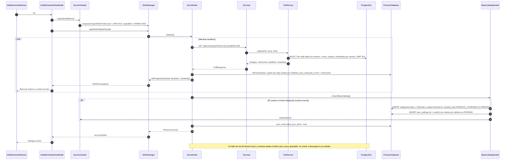

# SEQ-02 · Descarga inicial de datos

Requisitos: REQ-AUT-05, HU-06, REQ-CAT-01 · Pantalla: Descargando tus datos

```mermaid
sequenceDiagram
    autonumber
    participant DS as InitialDownloadScreen
    participant VM as InitialDownloadViewModel
    participant SCH as SyncScheduler
    participant WM as WorkManager
    participant W as SyncWorker
    participant API as SyncApi
    participant PS as PullService
    participant PG as PostgreSQL
    participant DB as FinanceDatabase
    participant SEED as BaseCatalogSeeder

    DS->>VM: init
    VM->>SCH: requestInitialSync()
    SCH->>WM: enqueueUniqueWork("initial-sync", REPLACE, expedited, CONNECTED)
    VM->>WM: getWorkInfoByIdFlow(id)
    WM->>W: doWork()
    loop Mientras hasMore
        W->>API: GET /api/v1/sync/pull?since={cursor}&limit=500
        API->>PS: pull(userId, since, limit)
        PS->>PG: SELECT de cada tabla con version > since, unidas y ordenadas por version, LIMIT 501
        PS-->>API: changes, nextCursor, hasMore, remaining
        API-->>W: PullResponse
        W->>DB: withTransaction: upsert de cada cambio por entidad y sync_meta.pull_cursor = nextCursor
        W->>WM: setProgress(received, received + remaining)
        WM-->>VM: WorkInfo.progress
        VM-->>DS: Barra de avance y conteo por tipo
    end
    W->>SEED: ensureBaseCatalog()
    alt El usuario no tenía categorías (cuenta nueva)
        SEED->>DB: INSERT categorías base y "Intereses y cargos financieros" (system_key FINANCIAL_CHARGES) en PENDING
        SEED->>DB: INSERT user_settings (id = userId) con valores por defecto en PENDING
        SEED->>SCH: requestSync()
    end
    W->>DB: sync_meta.initial_sync_done = true
    W-->>WM: Result.success()
    WM-->>VM: SUCCEEDED
    VM-->>DS: Navega a Inicio
    Note over W,PG: Un fallo de red da Result.retry() y continúa desde el último pull_cursor guardado, sin volver a descargar lo ya recibido
```
