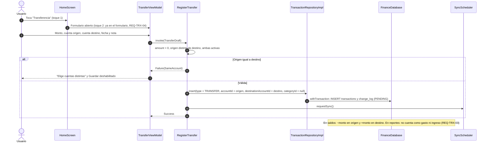

# SEQ-05 · Transferencia entre cuentas

Requisitos: REQ-TRX-02, 03, 04, HU-03 · Pantalla: Nueva transferencia (desde el acceso rápido de Inicio)

```mermaid
sequenceDiagram
    autonumber
    actor U as Usuario
    participant H as HomeScreen
    participant VM as TransferViewModel
    participant UC as RegisterTransfer
    participant TR as TransactionRepositoryImpl
    participant DB as FinanceDatabase
    participant SCH as SyncScheduler

    U->>H: Toca "Transferencia" (toque 1)
    H->>VM: Formulario abierto (toque 2: ya en el formulario, REQ-TRX-04)
    U->>VM: Monto, cuenta origen, cuenta destino, fecha y nota
    VM->>UC: invoke(TransferDraft)
    UC->>UC: amount > 0, origen distinto de destino, ambas activas
    alt Origen igual a destino
        UC-->>VM: Failure(SameAccount)
        VM-->>U: "Elige cuentas distintas" y Guardar deshabilitado
    else Válida
        UC->>TR: insert(type = TRANSFER, accountId = origen, destinationAccountId = destino, categoryId = null)
        TR->>DB: withTransaction: INSERT transactions y change_log (PENDING)
        UC->>SCH: requestSync()
        UC-->>VM: Success
    end
    Note over DB: En saldos: −monto en origen y +monto en destino. En reportes: no cuenta como gasto ni ingreso (REQ-TRX-03)
```
