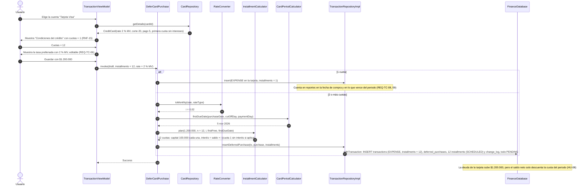

# SEQ-06 · Compra con tarjeta de crédito (1 o más cuotas)

Requisitos: REQ-TC-05, 06, 07, 09, 15, HU-08, RNF-15 · Pantalla: Nueva transacción con la tarjeta seleccionada

```mermaid
sequenceDiagram
    autonumber
    actor U as Usuario
    participant VM as TransactionViewModel
    participant UC as DeferCardPurchase
    participant CR as CardRepository
    participant RC as RateConverter
    participant IC as InstallmentCalculator
    participant PC as CardPeriodCalculator
    participant TR as TransactionRepositoryImpl
    participant DB as FinanceDatabase

    U->>VM: Elige la cuenta "Tarjeta Visa"
    VM->>CR: getDetails(cardId)
    CR-->>VM: CreditCard(rate 2 % MV, corte 20, pago 5, primera cuota sin intereses)
    VM-->>U: Muestra "Condiciones del crédito" con cuotas = 1 (RNF-15)
    U->>VM: Cuotas = 12
    VM-->>U: Muestra la tasa prellenada con 2 % MV, editable (REQ-TC-06)
    U->>VM: Guardar con $1.200.000
    VM->>UC: invoke(draft, installments = 12, rate = 2 % MV)
    alt 1 cuota
        UC->>TR: insert(EXPENSE en la tarjeta, installments = 1)
        Note over TR: Cuenta en reportes en la fecha de compra y en lo que vence del periodo (REQ-TC-08, 09)
    else 2 o más cuotas
        UC->>RC: toMonthly(rate, rateType)
        RC-->>UC: i = 0,02
        UC->>PC: firstDueDate(purchaseDate, cutOffDay, paymentDay)
        PC-->>UC: 5 nov 2026
        UC->>IC: plan(1.200.000, n = 12, i, firstFree, firstDueDate)
        IC-->>UC: 12 cuotas: capital 100.000 cada una, interés = saldo × i (cuota 1 sin interés si aplica)
        UC->>TR: insertDeferredPurchase(tx, purchase, installments)
        TR->>DB: withTransaction: INSERT transactions (EXPENSE, installments = 12), deferred_purchases, 12 installments (SCHEDULED) y change_log, todo PENDING
    end
    UC-->>VM: Success
    Note over DB: La deuda de la tarjeta sube $1.200.000, pero el saldo neto solo descuenta la cuota del periodo (HU-08)
```
