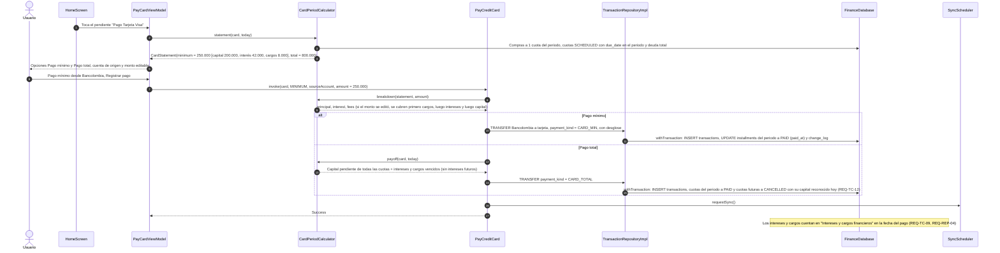

# SEQ-07 · Pagar la tarjeta (mínimo o total)

Requisitos: REQ-TC-08, 10, 11, 12, HU-09, F29 · Pantallas: Inicio (pendiente), Hoja Pagar tarjeta, Detalle de tarjeta

```mermaid
sequenceDiagram
    autonumber
    actor U as Usuario
    participant H as HomeScreen
    participant VM as PayCardViewModel
    participant PC as CardPeriodCalculator
    participant UC as PayCreditCard
    participant TR as TransactionRepositoryImpl
    participant DB as FinanceDatabase
    participant SCH as SyncScheduler

    H->>VM: Toca el pendiente "Pago Tarjeta Visa"
    VM->>PC: statement(card, today)
    PC->>DB: Compras a 1 cuota del periodo, cuotas SCHEDULED con due_date en el periodo y deuda total
    PC-->>VM: CardStatement(minimum = 250.000 [capital 200.000, interés 42.000, cargos 8.000], total = 800.000)
    VM-->>U: Opciones Pago mínimo y Pago total, cuenta de origen y monto editable
    U->>VM: Pago mínimo desde Bancolombia, Registrar pago
    VM->>UC: invoke(card, MINIMUM, sourceAccount, amount = 250.000)
    UC->>PC: breakdown(statement, amount)
    PC-->>UC: principal, interest, fees (si el monto se editó, se cubren primero cargos, luego intereses y luego capital)
    alt Pago mínimo
        UC->>TR: TRANSFER Bancolombia a tarjeta, payment_kind = CARD_MIN, con desglose
        TR->>DB: withTransaction: INSERT transactions, UPDATE installments del periodo a PAID (paid_at) y change_log
    else Pago total
        UC->>PC: payoff(card, today)
        PC-->>UC: Capital pendiente de todas las cuotas + intereses y cargos vencidos (sin intereses futuros)
        UC->>TR: TRANSFER payment_kind = CARD_TOTAL
        TR->>DB: withTransaction: INSERT transactions, cuotas del periodo a PAID y cuotas futuras a CANCELLED con su capital reconocido hoy (REQ-TC-12)
    end
    UC->>SCH: requestSync()
    UC-->>VM: Success
    Note over DB: Los intereses y cargos cuentan en "Intereses y cargos financieros" en la fecha del pago (REQ-TC-09, REQ-REP-04)
```
